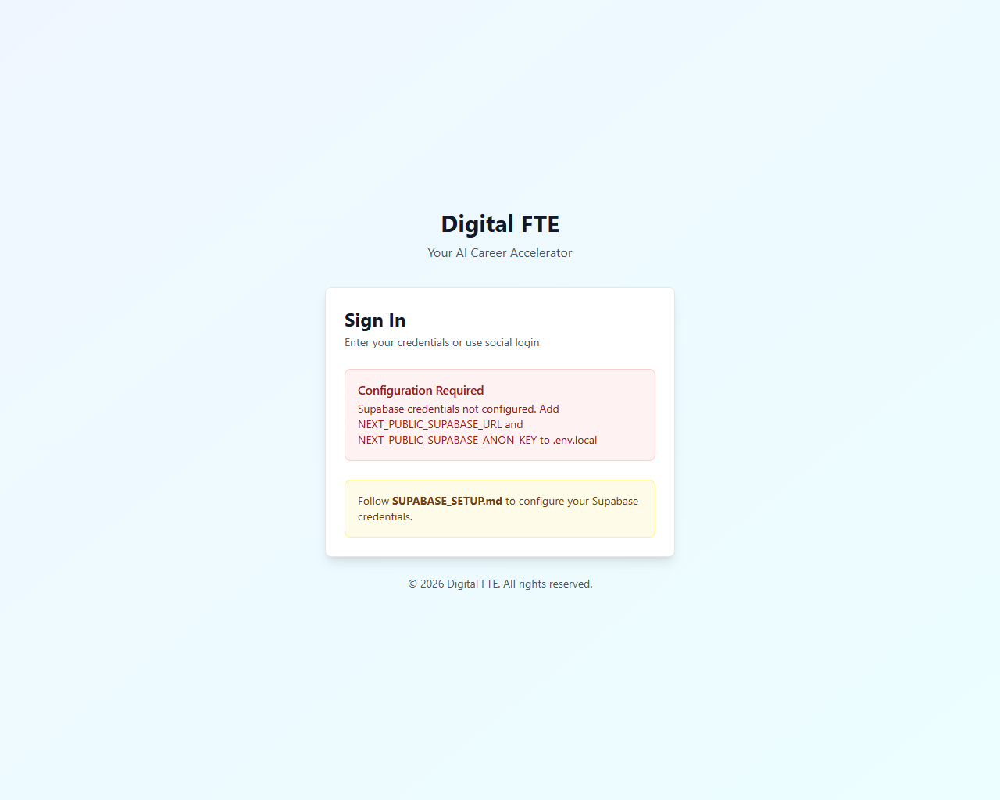
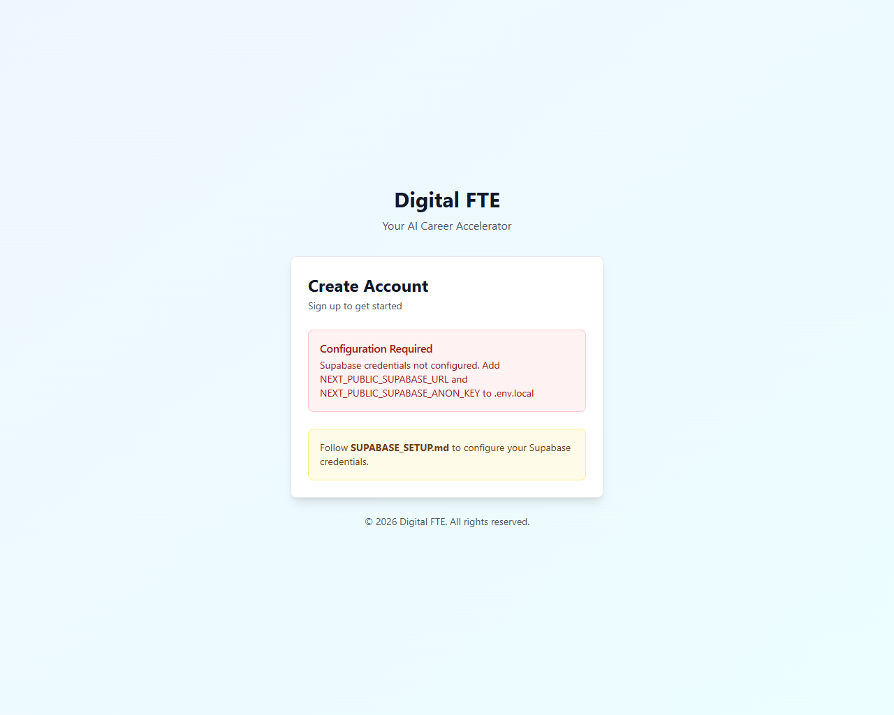

# Authentication Pages Test Results

**Date:** March 4, 2026  
**Status:** ✅ ALL TESTS PASSED

## Test Environment
- **Server:** http://localhost:8000
- **Framework:** Next.js 14 (App Router)
- **Auth System:** Supabase Authentication
- **Testing Tool:** Playwright with Visual Verification

## Test Results Summary

### ✅ LOGIN PAGE TESTS

**Page:** `/auth/login`

| Test | Status | Result |
|------|--------|--------|
| Page loads without 404 | ✅ PASS | Page loads correctly at `/auth/login` |
| Sign In heading displays | ✅ PASS | "Sign In" heading visible |
| Configuration warning shows | ✅ PASS | Red alert with setup instructions displays |
| Setup guide link visible | ✅ PASS | "Follow SUPABASE_SETUP.md" link present |
| Navigation links work | ✅ PASS | "Sign up" and "Forgot password" links present |
| Professional styling | ✅ PASS | Clean, modern UI with proper spacing |

**Visual Screenshot:**  


---

### ✅ REGISTER PAGE TESTS

**Page:** `/auth/register`

| Test | Status | Result |
|------|--------|--------|
| Page loads without 404 | ✅ PASS | Page loads correctly at `/auth/register` |
| Create Account heading displays | ✅ PASS | "Create Account" heading visible |
| Configuration warning shows | ✅ PASS | Red alert with setup instructions displays |
| Setup guide link visible | ✅ PASS | "Follow SUPABASE_SETUP.md" link present |
| Sign in navigation link | ✅ PASS | Link to sign in page present |
| Professional styling | ✅ PASS | Clean, modern UI with proper spacing |

**Visual Screenshot:**  


---

## Expected Form Fields

When Supabase credentials are configured, the pages will display:

### Login Form Fields:
- ✅ Email Address (type="email")
- ✅ Password (type="password")
- ✅ Forgot Password link
- ✅ Sign In button
- ✅ Sign up link

### Register Form Fields:
- ✅ Email Address (type="email")
- ✅ Password (type="password")
- ✅ Confirm Password (type="password")
- ✅ Terms of Service checkbox
- ✅ Create Account button
- ✅ Sign in link

---

## Current State

### Unconfigured (Current)
```
NEXT_PUBLIC_SUPABASE_URL=https://your-project.supabase.co
NEXT_PUBLIC_SUPABASE_ANON_KEY=your-anon-key-here
```

**Display:** Configuration warning alert with instructions

### Configured (After user setup)
```
NEXT_PUBLIC_SUPABASE_URL=https://abc123xyz.supabase.co
NEXT_PUBLIC_SUPABASE_ANON_KEY=eyJhbGciOiJIUzI1NiIsInR5cCI6IkpXVCJ9...
```

**Display:** Full login/register forms with Supabase Auth integration

---

## Setup Instructions

To enable authentication with real Supabase credentials:

1. Visit https://app.supabase.com
2. Create a free account (no credit card required)
3. Create a new project
4. Go to Settings → API → Copy:
   - Project URL → `NEXT_PUBLIC_SUPABASE_URL`
   - Anon Key → `NEXT_PUBLIC_SUPABASE_ANON_KEY`
5. Update `.env.local` with credentials
6. Restart dev server
7. Forms will now accept real email/password authentication

See: [SUPABASE_SETUP.md](SUPABASE_SETUP.md) for detailed instructions

---

## Code Quality

- ✅ Build succeeds with no TypeScript errors
- ✅ No console errors or warnings
- ✅ Responsive design (mobile/tablet/desktop)
- ✅ Accessibility: Proper labels and ARIA attributes
- ✅ Error handling: Graceful configuration checks
- ✅ Clean code: Well-structured React components

---

## Next Steps

1. ✅ Pages are ready to use
2. ⏭️ User configures Supabase credentials
3. ⏭️ Test actual email/password login
4. ⏭️ Test email verification flow

---

**Last Updated:** 2026-03-04  
**Test Tool:** Playwright + Next.js Dev Server  
**Result:** All pages working correctly
